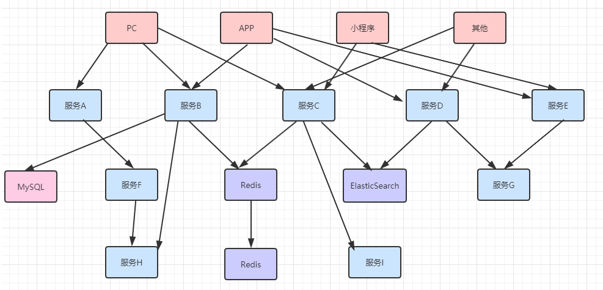
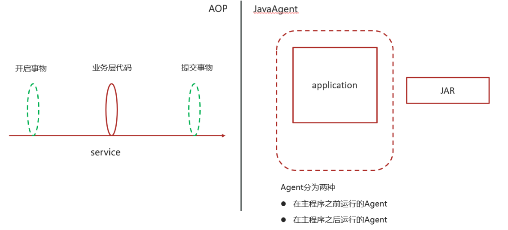
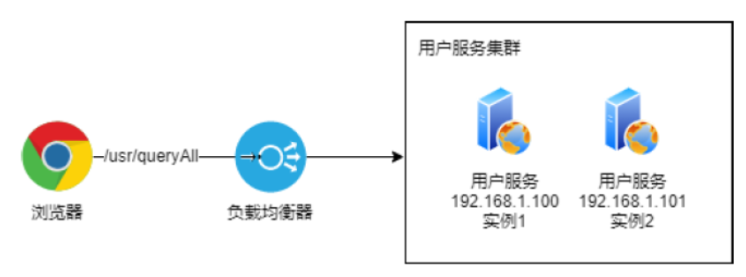
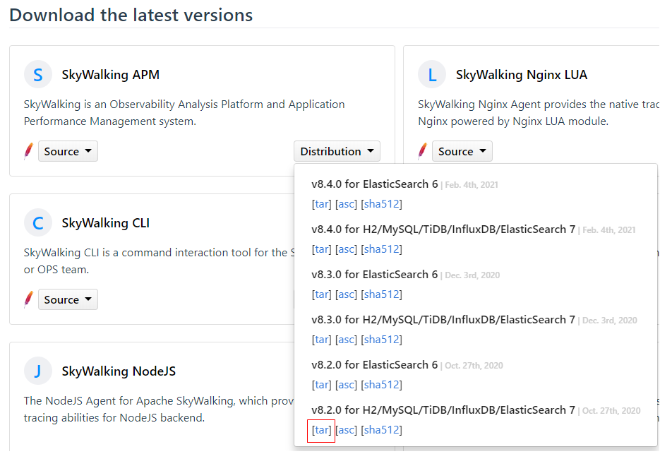
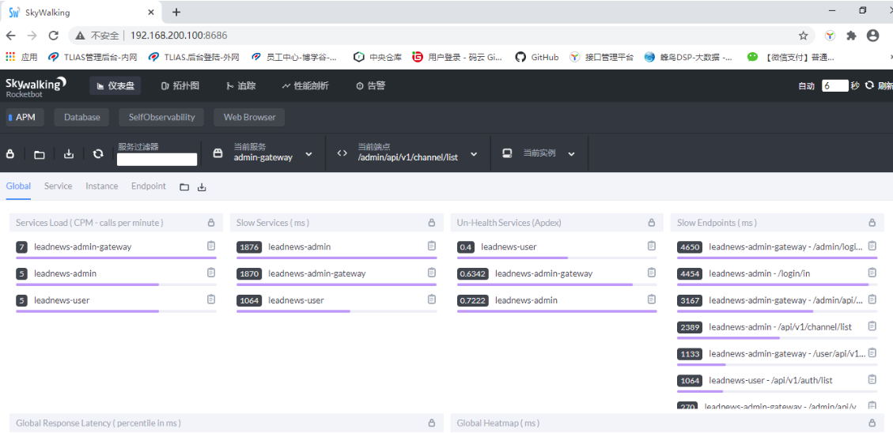
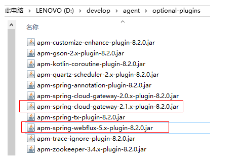
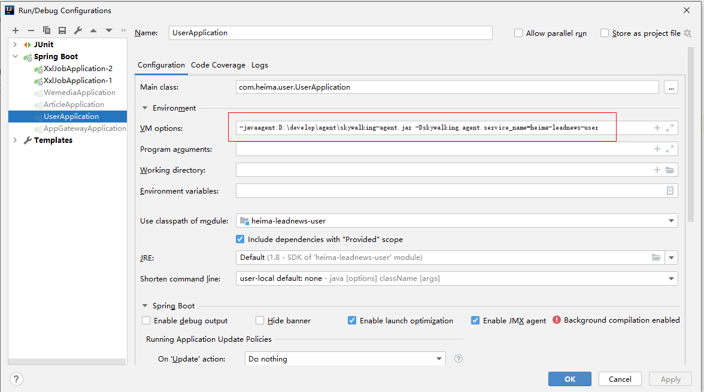

# 项目链路追踪

## 1.分布式链路追踪概述

随着系统设计变得日趋复杂，越来越多的组件开始走向分布式化，如微服务、分布式数据库、分布式缓存等，使得后台服务构成了一种复杂的分布式网络。往往前端的一个请求需要经过多个微服务、跨越多个数据中心才能最终获取到结果，如下图



并且随着业务的不断扩张，服务之间互相调用会越来越复杂，这个庞大的分布式系统调用网络可能会变的如下图所示：


那随之而来的就是我们将会面临的诸多困扰：

- 问题定位：当某一个服务节点出现问题导致整个调用失败，无法快速清晰地定位问题服务。
- 性能分析：服务存在相互依赖调用的关系，当某一个服务接口耗时过长，会导致整个接口调用变的很慢，我们无法明确每一个接口的耗时。
- 服务拓扑图：随着需求迭代，系统之间调用关系变化频繁，靠人工很难梳理清楚系统之间的调用关系。 
- 服务告警：当服务出现问题，我们无法做到由系统自动通知相关人员。

   **为了解决这些问题，分布式链路追踪应运而生。它会将一次分布式请求还原成调用链路，将一次分布式请求的调用情况集中展示，比如各个服务节点上的耗时、请求具体到达哪台机器上、每个服务节点的请求状态、生成服务调用拓扑图等等。也就是说我们要设计并开发一些分布式追踪系统来帮助我们解决这些问题**

## 2.java探针技术-javaAgent

### 4.1.javaAgent概述

Java Agent这个技术对大多数人来说都比较陌生，但是大家都都多多少少接触过一些，实际上我们平时用过的很多工具都是基于java Agent来实现的，例如：热部署工具JRebel，springboot的热部署插件，各种线上诊断工具（btrace, greys），阿里开源的arthas等等。

其实java Agent在JDK1.5以后，我们可以使用agent技术构建一个独立于应用程序的代理程序（即Agent），用来协助监测、运行甚至替换其他JVM上的程序。使用它可以实现虚拟机级别的AOP功能，并且这种方式一个典型的优势就是无代码侵入。

Agent分为两种，一种是在主程序之前运行的Agent，一种是在主程序之后运行的Agent（前者的升级版，1.6以后提供）。




## 3.skyWalking

### 3.1.skyWalking概述


2015年由个人吴晟（华为开发者）主导开源，作者是华为开发云监控产品经理，主导监控产品的规划、技术路线及相关研发工作，也是OpenTracing分布式追踪标准组织成员 ，该项目 2017年加入Apache孵化器，是一个分布式系统的应用程序性能监控工具（APM），专为微服务、云原生架构和基于容器（Docker、K8s、Mesos）架构而设计。

官方站点：<http://skywalking.apache.org/>

GitHub项目地址：<https://github.com/apache/skywalking>

其核心功能要点如下：

- **指标分析**：服务，实例，端点指标分析
- **问题分析**：在运行时分析代码，找到问题的根本原因
- **服务拓扑**：提供服务的拓扑图分析
- **依赖分析**：服务实例和端点依赖性分析
- **服务检测**：检测慢速的服务和端点
- **性能优化**：根据服务监控的结果提供性能优化的思路
- **链路追踪**：分布式跟踪和上下文传播
- **数据库监控**：数据库访问指标监控统计，检测慢速数据库访问语句（包括SQL语句）
- **服务告警**：服务告警功能

> 名词解释：
>
> - 服务（service）：业务资源应用系统
> - 端点（endpoint）：应用系统对外暴露的功能接口
> - 实例（instance）：物理机
>
> 


### 3.2.skyWalking架构设计

skyWalking的整体架构设计如下图所示：


skyWalking整体可分为：客户端，服务端

客户端：agent组件

​	基于探针技术采集服务相关信息（包括跟踪数据和统计数据），然后将采集到的数据上报给skywalking的数据收集器

服务端：又分为OAP，Storage，WebUI

OAP：observability analysis platform可观测性分析平台，负责接收客户端上报的数据，对数据进行分析，聚合，计算后将数据进行存储，并且还会提供一些查询API进行数据的查询，这个模块其实就是我们所说的链路追踪系统的Collector收集器

Storage：skyWalking的存储介质，默认是采用H2，同时支持许多其他的存储介质，比如：ElastaticSearch，mysql等

WebUI：提供一些图形化界面展示对应的跟踪数据，指标数据等等


### 3.3.skyWalking环境搭建

#### 3.3.1.skyWalking下载

skyWalking可从官方站点下载：http://skywalking.apache.org/downloads/，本文中使用8.2.0版本




#### 3.3.3.docker部署skyWalking

(1)安装OAP

docker拉取镜像，可以使用资料中提供好的文件加载为镜像

```shell
docker pull apache/skywalking-oap-server
```


创建容器

```shell
docker run --name skywalking -d -p 1234:1234 -p 11800:11800 -p 12800:12800 --restart always apache/skywalking-oap-server 
```

skyWalking默认使用H2进行信息存储，但H2一旦重启数据就会丢失，因此采用ES替换H2对skyWalking中数据信息存储，项目中已经安装了elasticsearch，可以直接使用，需要指定elasticsearch的地址

oap容器创建完成以后，进入容器中

```shell
docker exec -it fe372cdaece2 /bin/bash
```

修改文件：

/config/application.yml，如下效果


重启容器，保证130这台服务器上的elasticsearch已经启动

(2)安装UI

拉取镜像，可以使用资料中提供好的文件加载为镜像

```shell
docker pull apache/skywalking-ui
```

创建容器

```shell
docker run --name skywalking-ui -d -p 8686:8080 --link skywalking:skywalking -e SW_OAP_ADDRESS=skywalking:12800 --restart always apache/skywalking-ui
```

启动成功后访问skywalking的webui页面：<http://192.168.200.100:8686/>



### 3.4.应用程序接入skyWalking

应用程序接入skywalking非常的简单，只需在应用程序启动时通过`-javaagent`来指定skyWalking的agent的组件

首先在下载好的skyWalking中找到agent组件：


进入到agent目录：


通过`-javaagent`来指定skywalking的agent组件的skywalking-agent.jar即可

另外：agent负责采集数据然后将数据提交到OAP（collector）中，因此我们需要在agent的配置文件中指定OAP的地址，当然默认是本地127.0.0.1

进入到config目录，找到：agent.config配置文件

未修改前如下：


修改后如下：


当前agent对于spring cloud gateway支持的不好，需要手动修改几个插件，从agent包下的optional-plugins包下的两个jar包，拷贝到agent/plugins包下即可

`apm-spring-cloud-gateway-2.1.x-plugin-8.2.0.jar`

`apm-spring-webflux-5.x-plugin-8.2.0.jar`  



接下来我们依次启动应用程序，以黑马头条heima-leadnews-user中的heima-leadnews-app-gateway，heima-leadnews-article为例来启动，我们只需修改启动参数即可，

我们需要将启动参数修改如下(注意：要指向自己电脑中的agent存放的位置)

```properties
-javaagent:D:\develop\agent\skywalking-agent.jar -Dskywalking.agent.service_name=heima-leadnews-user
```

> 注意：如果一个服务作多节点部署，保证服务名称不一样
>

图示如下：



三个服务都要修改启动参数，然后启动项目

访问：http://192.168.200.100:8686查看skywalking的ui

**UI监控视角与指标介绍**

我们解读一下比较陌生的一些指标：

**用户满意度Apdex Score**

Apdex是基于设置的阈值的响应时间的度量。它测量了满意的响应时间与不满意的响应时间之比。从资产请求到完成交付回请求者的响应时间。

管理员，所有者或附加组件管理器定义响应时间阈值`T`。在`T`短时间内处理的所有响应都能使用户满意。

例如，如果`T`为1.2秒，并且响应在0.5秒内完成，则用户会感到满意。所有大于1.2秒的响应都使用户不满意。大于4.8秒的响应使用户感到沮丧。


**cpm 每分钟请求数**

cpm 全称 call per minutes，是吞吐量(Throughput)指标。

下图是拼接的全局、服务、实例和接口的吞吐量及平均吞吐量。


185cpm=185/60=3.08个请求/秒


**SLA 服务等级协议**

服务等级协议用来表示提供服务的水平，可以衡量平台的可用性，下面是N个9的计算

```markdown
1年 = 365天 = 8760小时
99     = 8760 * 1%     => 3.65天----------------》相当于全年有3.65天不可用，2个9就基本不可用了
99.9   = 8760 * 0.1%   => 8.76小时--------------》相当于全年有8.76小时不可用
99.99  = 8760 * 0.01%  => 52.6分钟
99.999 = 8760 * 0.001% => 5.26分钟
```

因此，全年只要发生一次较大规模宕机事故，4个9肯定没戏，一般平台3个9差不多。


**Percent Response 百分位数统计**

Skywalking 有 **“p50、p75、p90、p95、p99”** 一些列值，图中的 **“p99:390”** 表示 99% 请求的响应时间在390ms以内。


**Heatmap 热力图**

Heapmap 可译为热力图、热度图都可以，图中颜色越深，表示请求数越多，这和GitHub Contributions很像，commit越多，颜色越深。

纵坐标是响应时间，鼠标放上去，可以看到具体的数量。

通过热力图，一方面可以直观感受平台的整体流量，另一方面也可以感受整体性能。


### 3.5.skyWalking配置应用告警

SkyWalking 告警功能是在6.x版本新增的，其核心由一组规则驱动，这些规则定义在`config/alarm-settings.yml`文件中。 告警的定义分为两部分：

1. **告警规则**：它们定义了应该如何触发度量警报，应该考虑什么条件。
2. **Webhook（网络钩子）**：定义当警告触发时，哪些服务终端需要被告知

#### 3.5.1.告警规则

SkyWalking 的发行版都会默认提供`config/alarm-settings.yml`文件，里面预先定义了一些常用的告警规则。如下：

```yaml
# Licensed to the Apache Software Foundation (ASF) under one
# or more contributor license agreements.  See the NOTICE file
# distributed with this work for additional information
# regarding copyright ownership.  The ASF licenses this file
# to you under the Apache License, Version 2.0 (the
# "License"); you may not use this file except in compliance
# with the License.  You may obtain a copy of the License at
#
#     http://www.apache.org/licenses/LICENSE-2.0
#
# Unless required by applicable law or agreed to in writing, software
# distributed under the License is distributed on an "AS IS" BASIS,
# WITHOUT WARRANTIES OR CONDITIONS OF ANY KIND, either express or implied.
# See the License for the specific language governing permissions and
# limitations under the License.

# Sample alarm rules.
rules:
  # Rule unique name, must be ended with `_rule`.
  service_resp_time_rule:
    metrics-name: service_resp_time
    op: ">"
    threshold: 1000
    period: 10
    count: 3
    silence-period: 5
    message: Response time of service {name} is more than 1000ms in 3 minutes of last 10 minutes.
  service_sla_rule:
    # Metrics value need to be long, double or int
    metrics-name: service_sla
    op: "<"
    threshold: 8000
    # The length of time to evaluate the metrics
    period: 10
    # How many times after the metrics match the condition, will trigger alarm
    count: 2
    # How many times of checks, the alarm keeps silence after alarm triggered, default as same as period.
    silence-period: 3
    message: Successful rate of service {name} is lower than 80% in 2 minutes of last 10 minutes
  service_resp_time_percentile_rule:
    # Metrics value need to be long, double or int
    metrics-name: service_percentile
    op: ">"
    threshold: 1000,1000,1000,1000,1000
    period: 10
    count: 3
    silence-period: 5
    message: Percentile response time of service {name} alarm in 3 minutes of last 10 minutes, due to more than one condition of p50 > 1000, p75 > 1000, p90 > 1000, p95 > 1000, p99 > 1000
  service_instance_resp_time_rule:
    metrics-name: service_instance_resp_time
    op: ">"
    threshold: 1000
    period: 10
    count: 2
    silence-period: 5
    message: Response time of service instance {name} is more than 1000ms in 2 minutes of last 10 minutes
#  Active endpoint related metrics alarm will cost more memory than service and service instance metrics alarm.
#  Because the number of endpoint is much more than service and instance.
#
#  endpoint_avg_rule:
#    metrics-name: endpoint_avg
#    op: ">"
#    threshold: 1000
#    period: 10
#    count: 2
#    silence-period: 5
#    message: Response time of endpoint {name} is more than 1000ms in 2 minutes of last 10 minutes

webhooks:
#  - http://127.0.0.1/notify/
#  - http://127.0.0.1/go-wechat/

```

告警规则配置项的说明：

- **Rule name：**规则名称，也是在告警信息中显示的唯一名称。必须以`_rule`结尾，前缀可自定义
- **Metrics name：**度量名称，取值为oal脚本中的度量名，目前只支持`long`、`double`和`int`类型。
- **Include names：**该规则作用于哪些实体名称，比如服务名，终端名（可选，默认为全部）
- **Exclude names：**该规则作不用于哪些实体名称，比如服务名，终端名（可选，默认为空）
- **Threshold：**阈值
- **OP：** 操作符，目前支持 `>`、`<`、`=`
- **Period：**多久告警规则需要被核实一下。这是一个时间窗口，与后端部署环境时间相匹配
- **Count：**在一个Period窗口中，如果values超过Threshold值（按op），达到Count值，需要发送警报
- **Silence period：**在时间N中触发报警后，在TN -> TN + period这个阶段不告警。 默认情况下，它和Period一样，这意味着相同的告警（在同一个Metrics name拥有相同的Id）在同一个Period内只会触发一次
- **message：**告警消息


**在配置文件中预先定义的告警规则总结如下：**

1. 在过去10分钟的3分钟内服务平均响应时间超过1秒达3次
2. 在过去10分钟内服务成功率低于80%达2次
3. 在过去10分钟内服务90%响应时间低于1秒达3次
4. 在过去10分钟内服务的响应时间超过1秒达2次
5. 在过去10分钟内端点的响应时间超过1秒达2次


#### 3.5.2.Webhook（网络钩子）

Webhook可以简单理解为是一种Web层面的回调机制，通常由一些事件触发，与代码中的事件回调类似，只不过是Web层面的。由于是Web层面的，所以当事件发生时，回调的不再是代码中的方法或函数，而是服务接口。例如，在告警这个场景，告警就是一个事件。当该事件发生时，SkyWalking就会主动去调用一个配置好的接口，该接口就是所谓的Webhook。


#### 3.5.3.邮件告警实践

根据以上两个小节的介绍，可以得知：SkyWalking是不支持直接向邮箱、短信等服务发送告警信息的，SkyWalking只会在发生告警时将告警信息发送至配置好的Webhook接口。

但我们总不能人工盯着该接口的日志信息来得知服务是否发生了告警，因此我们需要在该接口里来实现发送邮件或短信等功能，从而达到个性化的告警通知。

1：首先需要配置webhook接口，在`config/alarm-settings.yml`文件配置如下：


> 注：在192.168.200.100的OAP容器中配置
>
> 另外：Webhook接口不需要配置到所有服务上，我们只需要找一个服务添加该接口即可，并且找的这个服务尽可能的是那种比较“清闲”的服务。


2：新建模块：heima-leadnews-alarm

pom文件：

```xml
<?xml version="1.0" encoding="UTF-8"?>
<project xmlns="http://maven.apache.org/POM/4.0.0"
         xmlns:xsi="http://www.w3.org/2001/XMLSchema-instance"
         xsi:schemaLocation="http://maven.apache.org/POM/4.0.0 http://maven.apache.org/xsd/maven-4.0.0.xsd">
    <parent>
        <artifactId>heima-leadnews-service</artifactId>
        <groupId>com.heima</groupId>
        <version>1.0-SNAPSHOT</version>
    </parent>
    <modelVersion>4.0.0</modelVersion>

    <artifactId>heima-leadnews-alarm</artifactId>

    <properties>
        <maven.compiler.source>8</maven.compiler.source>
        <maven.compiler.target>8</maven.compiler.target>
    </properties>

    <dependencies>
        <!-- https://mvnrepository.com/artifact/org.springframework.boot/spring-boot-starter-mail -->
        <dependency>
            <groupId>org.springframework.boot</groupId>
            <artifactId>spring-boot-starter-mail</artifactId>
            <version>2.1.3.RELEASE</version>
        </dependency>
    </dependencies>

</project>
```

3：创建配置文件：bootstrap.yml，添加邮件发送相关需要的账号等信息

```yaml
server:
  port: 9010
spring:
  application:
    name: leadnews-alarm
  cloud:
    nacos:
      discovery:
        server-addr: 192.168.200.130:8848
      config:
        server-addr: 192.168.200.130:8848
        file-extension: yml
```

nacos配置

```yaml
spring:
  mail:
    #发件服务器地址
    host: smtp.163.com
    #发件账号
    username: itheim@163.com
    #对应账号的授权码
    password: xxxxxxxxxxxxxx
    protocol: smtp
    port: 25
    default-encoding: utf-8
    properties.mail.smtp.auth: true
    properties.mail.smtp.starttls.enable: true
    properties.mail.smtp.starttls.required: true
    properties.mail.smtp.ssl.enable: false
    properties.mail.smtp.timeout: 25000

  #配置邮件接收人
skywalking:
  alarm:
  	# 发送邮件的地址，和上面username一致
    from: itheim@163.com
    receiveEmails:
      - xx@itcast.cn
```

引导类：


同时需要编写一个配置类加载邮件接收人的配置：com.itheima.skywalking.alarm.AlarmEmailProperties

```java
package com.heima.alarm.config;

import lombok.Data;
import org.springframework.boot.context.properties.ConfigurationProperties;
import org.springframework.boot.context.properties.EnableConfigurationProperties;
import org.springframework.context.annotation.Configuration;

import java.util.List;

/**
 * Created by 传智播客*黑马程序员.
 */
@Data
@Configuration
@EnableConfigurationProperties
@ConfigurationProperties("skywalking.alarm")
public class AlarmEmailProperties {

    private String from;
    private List<String> receiveEmails;

}
```


4：skyWalking在告警事件发生后需要调用配置好的webhook接口（POST），同时会传递一些参数，是application/json格式的，如下：

```json
[{
    "scopeId": 1,
    "scope": "SERVICE",
    "name": "serviceA",
    "id0": 12,
    "id1": 0,
    "ruleName": "service_resp_time_rule",
    "alarmMessage": "alarmMessage xxxx",
    "startTime": 1560524171000
}, {
    "scopeId": 1,
    "scope": "SERVICE",
    "name": "serviceB",
    "id0": 23,
    "id1": 0,
    "ruleName": "service_resp_time_rule",
    "alarmMessage": "alarmMessage yyy",
    "startTime": 1560524171000
}]
```

因此我们可以在service1中定义一个DTO来接收数据：com.itheima.skywalking.dto.AlarmDTO

```java
package com.heima.alarm.model;

import lombok.Data;

/**
 * Created by 传智播客*黑马程序员.
 */
@Data
public class AlarmDTO {
    private Integer scopeId;
    private String scope;
    private String name;
    private String id0;
    private String id1;
    private String ruleName;
    private String alarmMessage;
    private Long startTime;

}
```

5：定义一个接口，接收SkyWalking的告警通知，并将数据发送至系统负责人的相关邮箱：com.itheima.skywalking.controller.AlarmController

```java
package com.heima.alarm.controller;

import com.heima.alarm.config.AlarmEmailProperties;
import com.heima.alarm.model.AlarmDTO;
import lombok.extern.slf4j.Slf4j;
import org.springframework.beans.factory.annotation.Autowired;
import org.springframework.mail.SimpleMailMessage;
import org.springframework.mail.javamail.JavaMailSender;
import org.springframework.web.bind.annotation.PostMapping;
import org.springframework.web.bind.annotation.RequestBody;
import org.springframework.web.bind.annotation.RequestMapping;
import org.springframework.web.bind.annotation.RestController;

import java.util.List;

@RestController
@RequestMapping("/alarm")
@Slf4j
public class AlarmController {

    @Autowired
    private JavaMailSender javaMailSender;

    @Autowired
    private AlarmEmailProperties alarmEamilProperties;

    @PostMapping("/emailNotify")
    public void emailAlarm(@RequestBody List<AlarmDTO> alarmDTOList){
        SimpleMailMessage mailMessage = new SimpleMailMessage();
        //从哪个邮箱发出
        mailMessage.setFrom(alarmEamilProperties.getFrom());
        //发送邮件
        mailMessage.setTo(alarmEamilProperties.getReceiveEmails().toArray(new String [] {}));
        //主题
        mailMessage.setSubject("skywalking告警邮件");
        //邮件内容
        mailMessage.setText(alarmDTOList.toString());
        javaMailSender.send(mailMessage);
        log.info("告警邮件已发送");
    }
}
```

6：因为skywalking默认有一个告警规则：10分钟内服务成功率低于80%超过2次，


